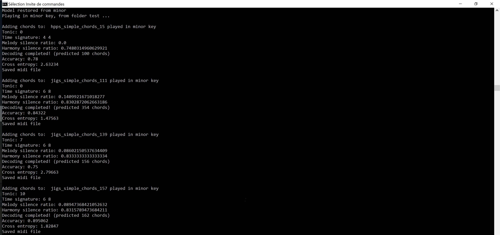

# Automatic Melody Harmonization with Attention

TensorFlow implementation of a LSTM encoder decoder with attention (over a keyboard) to harmonize melodies with chords.
It works with the Nottingham MIDI dataset in major or minor key.


## Requirements
- Python 2.7 or 3.5
- [TensorFlow 1.0.1](https://www.tensorflow.org/install/)
- [tqdm](https://pypi.python.org/pypi/tqdm)
- [midicsv](http://www.fourmilab.ch/webtools/midicsv/) - and csvmidi

## Usage

- Fill the folders train and test with MIDI files

- Train a model:
```
> python train.py --mode=minor --batch_size=64 --is_training=True --restore_model=False
```

- Visualize summary on tensorboard
```
> tensorboard --logdir=summary/minor
```

- Harmonize the MIDI files in the test folder (collect files in output foler)
```
> python test.py --mode=minor --batch_size=1 --is_training=False --restore_model=True
```




- Use Ableton to listen to your harmonized MIDI files

## Results

### Minor key


## Author

Michel Deudon / [@mdeudon]
